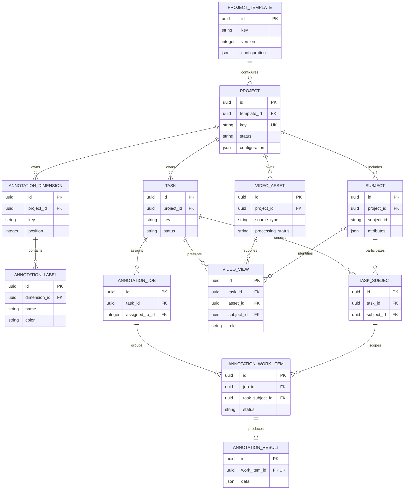

# Core data model

Lessons 5 and 8 establish the configuration and work-assignment domains.

## Invariants

- Template `(key, version)` pairs are unique and versions start at one.
- Project keys are globally unique and status is constrained to a known value.
- Dimension keys are unique within a project.
- Label names are unique within a dimension; colors use `#RRGGBB` syntax.
- Subject identifiers are unique within a project.
- Deleting a project cascades to its dimensions, labels, and subjects.
- Deleting a template referenced by a project is protected.
- Task keys are unique inside a project and selected subjects belong to it.
- A project defines available subjects; each task selects a subset of them.
- `TaskSubject` makes every member of a task's subject subset explicit.
- Creating a parent annotation job creates one work item per `TaskSubject`.
- Each work item tracks one subject's lifecycle and owns at most one result.
- Video assets and subjects used by a view share the task's project.
- A task has at most one main view, one back view, and one view per subject.
- Duplicate task/annotator assignments and work items are prevented.
- Work-item status follows `assigned → in_progress → completed → reviewed`.

`configuration` and `attributes` are JSON for intentionally flexible metadata.
Relationships and identity remain relational so PostgreSQL can enforce them.
The result `data` field is intentionally flexible until later lessons introduce
typed annotation structures.
