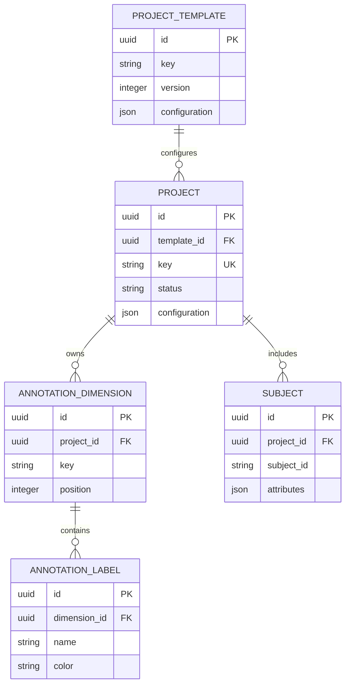

# Core data model

Lesson 5 introduces the configuration domain used by later APIs and workflows.

## Invariants

- Template `(key, version)` pairs are unique and versions start at one.
- Project keys are globally unique and status is constrained to a known value.
- Dimension keys are unique within a project.
- Label names are unique within a dimension; colors use `#RRGGBB` syntax.
- Subject identifiers are unique within a project.
- Deleting a project cascades to its dimensions, labels, and subjects.
- Deleting a template referenced by a project is protected.

`configuration` and `attributes` are JSON for intentionally flexible metadata.
Relationships and identity remain relational so PostgreSQL can enforce them.
